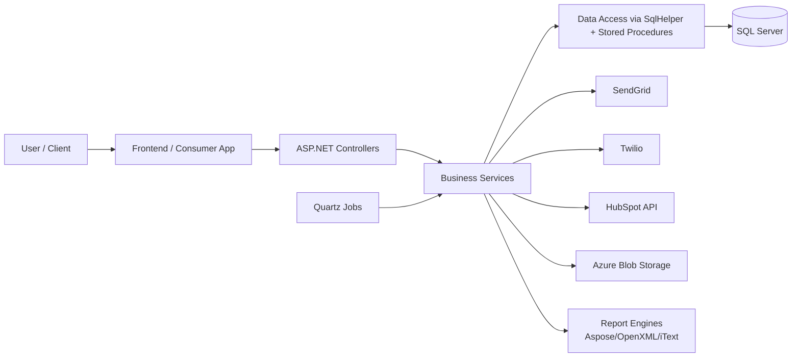
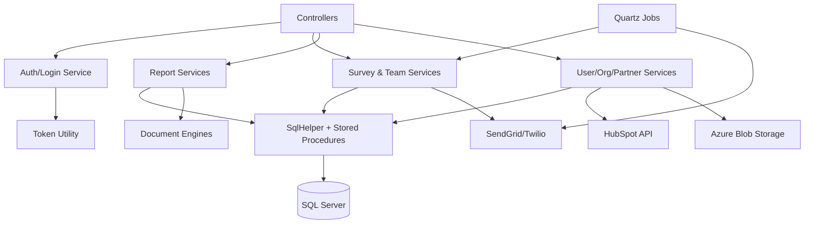
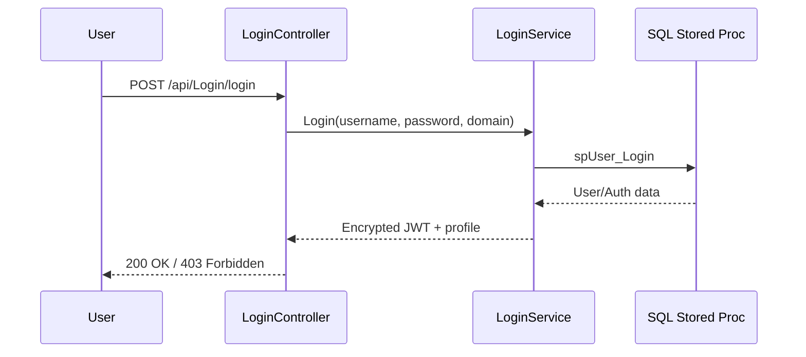
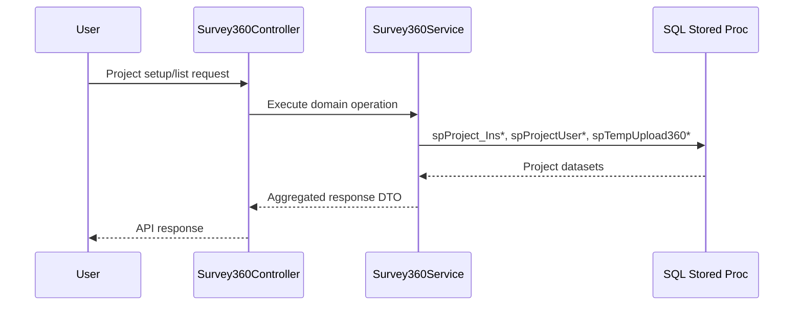
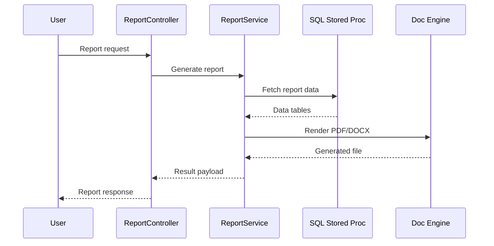
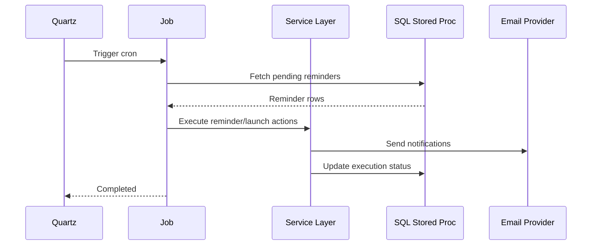
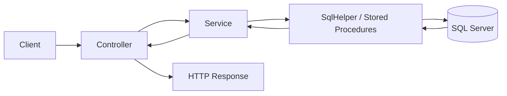

# Project Overview Documentation

> [!NOTE]
> This document summarizes the architecture and operational design of the **ThinkWise API** repository for developers, technical reviewers, and business stakeholders.

---

## Project Overview

### What the Project Does
ThinkWise is an ASP.NET Core Web API platform used to run and manage talent-development workflows such as **360 assessments**, **team surveys**, **hiring assessments**, **development plans**, and **report generation**.

### Problem It Solves
Organizations typically run these workflows across disconnected tools (survey tools, spreadsheets, email templates, report tools). ThinkWise centralizes this into one backend platform that:
- orchestrates participant lifecycle and project status,
- automates reminders and scheduled actions,
- generates structured reports for decision-making,
- supports admin and partner-level multi-organization operations.

### Target Users
- Platform admins and partner administrators
- Organization admins and project owners
- Participants, respondents, interviewers, and candidates
- Operations teams handling communication and reporting

### Main Functionality
- Project setup and lifecycle management for multiple assessment types
- User, partner, organization, and order management
- Survey and response workflows (360 and team survey)
- Hiring workflow support (guides, candidate/interviewer flows)
- Report generation and distribution (individual/group/hiring/dev plans)
- File/logo upload and storage integration
- Scheduled reminder and launch automations

---

## Tech Stack

| Layer | Technology | How It Is Used |
| --- | --- | --- |
| Runtime | .NET Core 3.1 (`netcoreapp3.1`) | Core application runtime |
| Web API Framework | ASP.NET Core Web API | REST endpoints with attribute routing |
| API Documentation | Swagger / Swashbuckle | Interactive API docs and testing |
| Authentication | JWT Bearer | Access token validation for protected endpoints |
| Token Utility | Custom token encryption/decryption | Token obfuscation/encryption in middleware and utility methods |
| Business Layer | Service-oriented C# classes | Domain logic implementation |
| Data Access | `Microsoft.ApplicationBlocks.Data` (`SqlHelper`) | Stored-procedure-based DB access |
| ORM Artifacts | Entity Framework Core models present | Supplemental data model scaffolding (`ThinkwiseCentraldevContext`) |
| Database | SQL Server | Primary system-of-record |
| Scheduling | Quartz | Background jobs (reminders, launch processing) |
| Email/Comms | SendGrid, Twilio | Invitation/reminder/notification workflows |
| External CRM | HubSpot API (via RestSharp) | Contact synchronization flows |
| Storage | Azure Blob Storage | File and logo uploads |
| Document/Reporting | Aspose, OpenXML, iText, EPPlus, GemBox | Report and document generation |
| Deployment Pattern | IIS/Azure-style hosting compatibility | Build assets and configuration support web deployment |
| CI/CD Pipeline | CI/CD Pipeline (Azure DevOps / GitHub Actions) | Automated build, validation, and deployment |

> [!IMPORTANT]
> The project is primarily **stored-procedure-driven**, not a strict repository-pattern implementation.

---

## System Architecture

The application follows a layered API architecture:
- **Client/Frontend** calls REST endpoints.
- **Controllers** handle routing, validation, response shaping.
- **Services** implement domain logic and orchestration.
- **Repository-equivalent data access** is implemented in services via `SqlHelper` + stored procedures.
- **SQL Server** stores transactional and reporting data.

### Mermaid Architecture Diagram



### Component Role Summary
- **Frontend/Consumer App**: External web clients or admin apps consuming APIs.
- **Controllers**: API boundary and HTTP contract enforcement.
- **Services**: Business rules, orchestration, integration, and data shaping.
- **Repository-equivalent access**: Stored-procedure execution and dataset retrieval.
- **Database**: Persistent store for users, projects, tasks, surveys, reports, and audit data.

---

## Folder Structure

```text
thinkwise-api/
+- ThinkWise/
�  +- Controller/
�  +- EmailTemplates/
�  +- Languages/
�  +- ReportImages/
�  +- ReportTemp/
�  +- TW360RosterErrors/
�  +- Program.cs
�  +- Startup.cs
�  +- appsettings.json
+- ThinkWise.Business/
�  +- IService/
�  +- Service/
�  +- CustomModel/
�  +- Common/
�  +- Model/
�  +- Translate/
+- Aspose/
+- Build/
+- DeveloperDoc/
```

### Folder Responsibilities
- `ThinkWise/Controller`: API endpoints by domain (19 controller files).
- `ThinkWise.Business/Service`: Core domain and integration logic (25 service files).
- `ThinkWise.Business/IService`: Service contracts and dependency injection interfaces (23 files).
- `ThinkWise.Business/CustomModel`: DTOs and request/response payload models.
- `ThinkWise.Business/Common`: Shared helpers for config, token handling, encryption, storage utilities.
- `ThinkWise.Business/Model`: EF model context and entity mapping scaffolds.
- `ThinkWise/EmailTemplates`, `Languages`, `ReportImages`, `ReportTemp`: communication/reporting assets and runtime content.

---

## Main Components

### 1) Authentication Module
- **Purpose**: Authenticate users and secure protected API endpoints.
- **Responsibilities**: login, token generation, token refresh, bearer token validation.
- **Important components**:
  - `ThinkWise/Controller/LoginController.cs`
  - `ThinkWise.Business/Service/LoginService.cs`
  - `ThinkWise.Business/Common/common.cs`
  - `ThinkWise/Startup.cs` (JWT configuration)

### 2) API Controller Layer
- **Purpose**: Expose business capabilities via REST endpoints.
- **Responsibilities**: route mapping, request validation, response codes.
- **Important components**:
  - `ThinkWise/Controller/*.cs` (Survey, TeamSurvey, Hiring, Report, User, Upload, etc.)

### 3) Business Services Layer
- **Purpose**: Implement domain rules and process orchestration.
- **Responsibilities**: execute workflows, call DB procedures, trigger comms/report generation.
- **Important components**:
  - `ThinkWise.Business/Service/Survey360Service.cs`
  - `ThinkWise.Business/Service/TeamSurveyService.cs`
  - `ThinkWise.Business/Service/HiringService.cs`
  - `ThinkWise.Business/Service/ReportService.cs`

### 4) Data Access Layer (Repository-equivalent)
- **Purpose**: Persist/retrieve business data.
- **Responsibilities**: execute SQL stored procedures and return datasets/tables.
- **Important components**:
  - `SqlHelper.ExecuteDataset` usage across service classes
  - SQL procedure contracts such as `spUser_Get*`, `spProject_Ins*`, `spDevObjective_Get*`

### 5) Reporting & Document Module
- **Purpose**: Produce business and assessment reports.
- **Responsibilities**: compose data, render templates, generate output documents.
- **Important components**:
  - `ThinkWise.Business/Service/*Report*.cs`
  - `Aspose/` libraries, OpenXML, iText integrations

### 6) External Integrations Module
- **Purpose**: Connect platform to communication and storage providers.
- **Responsibilities**: send notifications, upload files, contact sync.
- **Important components**:
  - SendGrid/Twilio logic in service layer
  - HubSpot contact operations in `LoginService`
  - Azure Blob logic in `Common.UploadFileToAzure`

### 7) Scheduler Module
- **Purpose**: Run time-based automation.
- **Responsibilities**: launch scheduling and reminder processing.
- **Important components**:
  - `ThinkWise.Business/Service/SendMailJob.cs`
  - `ThinkWise.Business/Service/LaunchProjectCron.cs`
  - Quartz setup in `ThinkWise/Startup.cs`

### Component Diagram



---

## Key Workflows

### Workflow 1: User Login
1. Client submits credentials to `LoginController`.
2. Controller calls `LoginService.Login`.
3. Service validates user via stored procedure (`spUser_Login`).
4. JWT token is generated and encrypted.
5. Controller returns token and user context.



### Workflow 2: 360 Project Management
1. Client calls `Survey360Controller` endpoint to create/update/list projects.
2. Service executes stored procedures for project, item, roster, and relationship updates.
3. Progress and response state are computed and returned.



### Workflow 3: Report Generation
1. User requests report from report endpoint.
2. Service retrieves report data from DB.
3. Service generates document output using reporting libraries.
4. Response returns generated output metadata/content.



### Workflow 4: Scheduled Reminder Processing
1. Quartz triggers job based on cron schedule.
2. Job loads pending reminders/schedules from DB.
3. Job invokes service/email routines.
4. Status updates are persisted.



---

## API Flow Overview

### Request Lifecycle
`Client -> Controller -> Service -> Data Access (SqlHelper) -> SQL Server -> Service -> Controller -> Response`



> [!TIP]
> Treat the service layer as the primary orchestration boundary. Keep controllers thin and avoid pushing business logic into API endpoints.

---

## System Highlights

| Area | Current Strength |
| --- | --- |
| Scalability | Layered API with modular domain services and background job support |
| Security | JWT auth, bearer validation, and protected endpoint attributes |
| Authentication | Login/refresh/access-key flows via dedicated auth service |
| Background Processing | Quartz-based scheduled automation for reminders and launches |
| Integration Readiness | Built-in hooks for SendGrid, Twilio, HubSpot, Azure Blob |
| Reporting Capability | Mature report pipeline with enterprise document libraries |
| Error Handling | Try/catch patterns in controllers/services with status-based responses |

---

## Documentation Notes

- This documentation intentionally focuses on architecture and system behavior.
- It references key files and modules without copying full source files.
- Diagrams are Mermaid-compatible for GitHub/GitLab rendering.
- Suitable for architecture reviews, onboarding, and stakeholder presentations.

---

### Deliverable
File created: `DeveloperDoc/ProjectOverview.md`
