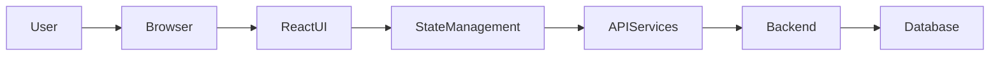

# Project Overview

> **Callout**
> This document focuses on architecture and workflows. It references key modules and files.

---

## What The Project Does

This React client is the primary web interface for the Cantoo platform. It enables organizations to run multi-participant assessments and surveys, including 360 feedback, team surveys, development plans, and hiring assessments. The application solves the problem of coordinating survey setup, participant management, task completion, and report generation in a single, role-based web experience.

Target users include HR leaders, organizational admins, project administrators, coaches, and survey participants. The system’s core functionality covers authentication, project and roster management, survey execution, report generation, and administrative oversight.

---

## Tech Stack

| Layer | Technology |
|---|---|
| Frontend Framework | React 17 with Create React App (react, react-dom, react-scripts) |
| Language | JavaScript (ES6+) |
| Routing | React Router v5 (react-router-dom) |
| State Management | Redux + Thunk (redux, react-redux, redux-thunk) |
| Styling | Material UI v4 and MUI v5, Emotion, Styled Components |
| UI Components | Kendo React UI suite |
| Forms | Formik + Yup |
| Notifications | Notistack, SweetAlert2 |
| HTTP / API | Axios with interceptors |
| Charts / Visualization | Kendo Charts, Chart.js, Recharts, ApexCharts |
| Drag and Drop | react-beautiful-dnd, react-sortable-hoc |
| Rich Text / Editors | Draft.js, react-draft-wysiwyg, HTML import/export helpers |
| Document / Export | jsPDF, html2canvas, docx, jszip, file-saver, Excel helpers |
| Date / Time | Moment, date-fns, MUI pickers |
| Testing | React Testing Library |
| Build Tooling | Create React App (react-scripts), cross-env |
| Hosting | Not specified in repository |

---

## System Architecture

Component roles:
User and Browser: Human interaction and browser runtime.
React UI: Screens, workflows, and layout composed of React components.
State Management: Redux store and reducers for cross-feature state.
API Services: Axios clients and centralized API route definitions.
Backend: REST APIs hosted on Azure endpoints.
Database: Persisted survey, user, and report data managed by backend services.

---

## Folder Structure

text
/src
  /assets
  /components
  /function
  /helpers
  /redux
  App.js
  index.js

Folder responsibilities:
src/assets: Static images, icons, templates, and font assets.
src/components: Feature modules and UI screens (auth, surveys, reports, admin, layout).
src/function: Client-side report generation, export helpers, and rendering utilities.
src/helpers: API clients, constants, shared utilities, theme, and validation helpers.
src/redux: Redux actions, reducers, and store configuration.

---

## Main Components

Authentication and Access Control: Handles login, signup, reset flows, and route guards. Key files: src/components/Signin.jsx, src/components/Signup.jsx, src/components/ResetPassword.jsx, src/components/common/CustomFunction.jsx.
Layout and Navigation: Application shell, navigation, and responsive layout. Key files: src/components/layout/index.jsx, src/components/layout/Navbar.jsx, src/components/layout/Sidebar.jsx.
360 Survey Module: Project setup, competency selection, roster management, and participant flow. Key files: src/components/thinkwise_360/projects/index.jsx, src/components/thinkwise_360/projects/steps.
Team Survey Module: Team survey setup, tasks, reminders, and reporting. Key files: src/components/Teamsurvey.
Development Plan and Assessment: Development plans, assessments, and feedback workflows. Key files: src/components/development.
Hiring Projects: Hiring surveys, interviews, candidate management, and reports. Key files: src/components/hiring_project.
Reporting and Exports: PDF and Word report generation, chart rendering, and exports. Key files: src/components/Report, src/function/GroupReport.js, src/function/Individualreportgeneration.js.
State Management Layer: Redux store, actions, and reducers for app state. Key files: src/redux/store/ConfigureStore.js, src/redux/reducers/RootReducer.js.
API Layer: Axios clients and centralized API endpoints. Key files: src/helpers/API.js, src/helpers/APIONE.js, src/helpers/constants/ApiRoutes.js.

mermaid
flowchart TD
Pages --> Components
Pages --> AuthService
AuthService --> APIServices
Components --> UIElements
APIServices --> Backend
Backend --> Database

---

## Key Workflows

### User Login

1. User submits credentials on sign-in screen.
2. UI sends login request to backend API.
3. Backend returns token and user metadata.
4. Token is stored in local storage and protected routes become available.

mermaid
sequenceDiagram
User->>ReactUI: Enter credentials
ReactUI->>APIServices: POST /api/Login/login
APIServices->>Backend: Authenticate user
Backend-->>APIServices: Token and user data
APIServices-->>ReactUI: Success response
ReactUI-->>User: Redirect to dashboard

### Create 360 Project

1. Admin chooses setup type and inputs project data.
2. UI saves project via Survey360 endpoints.
3. User selects competencies and items.
4. Roster is created or imported, then project is launched.

mermaid
sequenceDiagram
Admin->>ReactUI: Start new 360 project
ReactUI->>APIServices: POST /api/Survey360/startFromScratch
APIServices->>Backend: Create project
Backend-->>APIServices: Project id
ReactUI->>APIServices: POST /api/Survey360/addProjectItems
ReactUI->>APIServices: POST /api/RosterUpload/addToRoster
ReactUI->>APIServices: POST /api/Survey360/launchProject
APIServices-->>ReactUI: Launch confirmation

### Team Survey Task Completion

1. Participant follows invite link.
2. App loads task details by URL id.
3. Participant submits ratings and open-ended responses.
4. Backend stores responses and updates task status.

mermaid
sequenceDiagram
Participant->>ReactUI: Open task link
ReactUI->>APIServices: GET /api/TeamSurvey/getTeamSurveyLink
APIServices->>Backend: Resolve task
Backend-->>APIServices: Task context
ReactUI->>APIServices: POST /api/TeamSurvey/performConfirmation
APIServices-->>ReactUI: Submission result

### Report Generation

1. Admin requests a report.
2. UI triggers backend report generation.
3. Report metadata and content are returned.
4. Client renders PDF or Word export.

mermaid
sequenceDiagram
Admin->>ReactUI: Request report
ReactUI->>APIServices: POST /api/Report/ProjectSummaryReportGenerate
APIServices->>Backend: Generate report
Backend-->>APIServices: Report data
APIServices-->>ReactUI: Render and export

---

## API And Backend Communication Flow

mermaid
flowchart LR
ReactComponent --> ServiceLayer
ServiceLayer --> API
API --> Database
Database --> API
API --> ServiceLayer
ServiceLayer --> ReactComponent

Explanation:
React components call service helpers or direct Axios configs.
Requests flow through src/helpers/API.js or src/helpers/APIONE.js.
Endpoints are centralized in src/helpers/constants/ApiRoutes.js.
Backend responses update local state and UI.

> **Callout**
> The API base URL is configured in src/helpers/constants/ApiRoutes.js and points to an Azure-hosted REST backend.

---

## System Highlights

Scalability: Feature modules are separated by domain with large UI suites and data-driven components.
Security: Auth tokens are stored in local storage and gated by PrivateRoute checks.
Authentication: Login flow returns a token, with a refresh endpoint available (/api/Login/refreshToken).
Error Handling: Axios interceptors, Notistack snackbars, and SweetAlert2 dialogs.
Performance: Code-splitting with React.lazy and CRA build optimizations.
State Management: Centralized Redux store with feature-specific reducers.

---

## Documentation Notes

Architecture and workflow focus, minimal code references.
Diagrams use Mermaid for GitHub and GitLab compatibility.
This is a client-only view; backend internals are out of scope.
